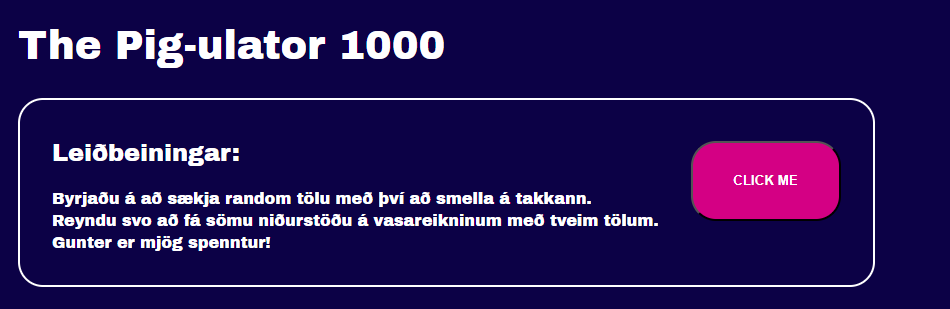
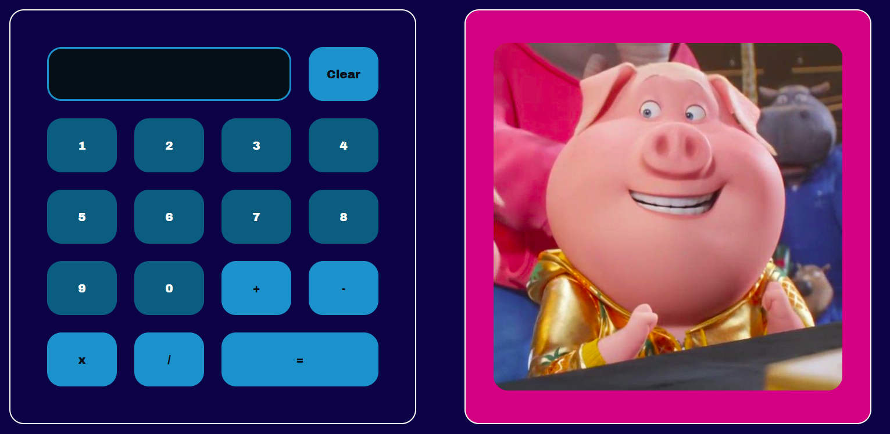

# 🎯 Calculator Challenge

A browser-based math game built with JavaScript.

## What it does

A random target number is generated at the start. Using the calculator,
you try to reach that exact number through addition, subtraction,
multiplication, or division. Hit the target and a dancing pig celebrates
your success! Miss the target and a sad pig 🐷😢 commiserates with you. 

## What it demonstrates

- DOM manipulation with JavaScript
- Event listeners and button handling
- Basic game logic and conditional rendering
- HTML/CSS layout

## How to run

Just open `index.html` in any browser — no installation needed.

## Screenshots

## gifs

## Built with

- HTML, CSS, JavaScript
- [Evening class project — University/School name, Year]
